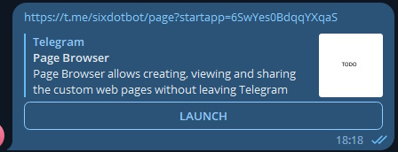

# ContentEditBot

## Table of Contents
- [About](#about)
- [Extensibility](#extensibility)
- [Installation and Running](#installation-and-running)
	- [Local Setup](#local-setup)
	- [Hosting Setup](#hosting-setup)
	- [Configuration](#configuration)
	- [Creating a WebApp with BotFather](#creating-a-webapp-with-botfather)
- [Simplicity Considerations](#simplicity-considerations)
- [Behavior and Usage](#behavior-and-usage)
- [Mobile Scrolling Issue](#mobile-scrolling-issue)
- [API Reference](#api-reference)
- [License](#license)

## About

ContentEditBot is a versatile Telegram bot that harnesses the power of MiniApps, enabling users to effortlessly create their own MiniApp pages without any programming knowledge and share them within Telegram for easy access by other Telegram users. While the concept is simple — users create pages and populate them with content — the possibilities are limitless. For instance, a small shopkeeper can create a page to promote their merchandise, showcase products with images and descriptions, and provide PM link for potential customers. ContentEditBot makes all of this possible, offering a user-friendly WebApp interface with formatting capabilities that surpass regular Telegram messages.

This app was developed by a single person as a submission for the Telegram MiniApp contest, where it had to be created from scratch in about two weeks. As a result, it may have some rough edges and is considered somewhat unpolished.

## Features

- Drag-and-Drop page editor
- Markdown Support
- Extensible
- Simple concept
- User-friendly interface
- Seamless Telegram integration

## Extensibility

ContentEditBot is designed not as a complete, ready-to-use bot, but as a core or framework that allows anyone to tailor it to their specific needs. The out-of-the-box set of blocks and features serves as a showcase of the app's capabilities. Developers can extend it to add any imaginable blocks, enabling them to create their own bots that empower *their* users to create and share custom rich content. Refer to the [Block Framework section](docs/api-reference.md#adding-new-block-types) for details on how to extend the bot.

Here are just a few vercors of extending the bot that comes to mind:
- Carouseld and product cards to enable users create own marketplaces.
- Reactions so the visitors coming to the page from different sources can see what others thinks of it.
- Charts with any level of interactivity.
- Input blocks enabling page visitors to fill in their own data and submit it. Data submitted this way can be sent to the user within the bot chat.
- Gathering advanced page analytics based on the Telegram user data
- *And much more*

## Installation and Running

You can run ContentEditBot locally or on any hosting platform that supports the WSGI interface. Here are the general steps:

1. Create your bot with [BotFather](https://t.me/BotFather). You'll need the bot token and username later.
2. Set up and run the app locally or on the hosting platform.
	- For local setup, follow the [Local Setup Guide](#local-setup).
	- For hosting setup, refer to the [Hosting Setup Guide](#hosting-setup).
3. Configure environment variables.
4. Create a web app with BotFather.

### Local Setup

Running the bot locally is useful for development and testing purposes. Ensure you have the following tools installed: git and python3. Python's executable should be configured in the PATH variable.

1. (If you don't have a public IP) Use any tunneling software to make port 80 accessible from the outside. For example, using ngrok: `ngrok http 80`. The HTTP address you get will be needed for configuring the `APP_HOST` environment variable.
2. Open your console (cmd, powershell, or bash).
3. Execute the command: `git clone https://github.com/khaelar/ContentEditBot.git`
4. Navigate to the cloned directory: `cd ./ContentEditBot`
5. Create a Python virtual environment (recommended): `python .venv/bin/activate` (on Windows) or `source venv_name/bin/activate` (on Mac or Linux).
6. Install the required packages: `pip install -r requirements.txt`
7. Configure the `.env` file by following the instructions in the [Configuration](#configuration) section. Use your white IP (with https://) or the https link given by the tunneling software as the `APP_HOST` environment variable.
8. Start the app by executing: `python src/app.py --init --run`
9. Now, you can use your existing domain to proceed with BotFather configuration.
10. Visit your site domain to ensure it doesn't show any errors. It's normal for it to appear as an empty page since it is intended to function as a MiniApp.

### Hosting Setup

Different hosting providers may have various WSGI integration mechanisms, so consult their documentation to set everything up. Keep in mind that if the hosting runs your app in a disposable container, app data won't persist, and you may need to address this issue manually. The app stores data in a SQLite database on the disk, but switching to another database engine like PostgreSQL is an option.

Here is a detailed guide on how to install the app on PythonAnywhere hosting (fully functional on the free plan):

1. Navigate to the "Files" tab, ensuring the home directory is selected.
2. Click "Open Bash Console Here."
3. Execute the command: `git clone https://github.com/khaelar/ContentEditBot.git`
4. Go to the cloned directory: `cd ./ContentEditBot`
5. Create a Python virtual environment: `python3.10 -m venv .venv`
6. Activate the virtual environment: `source .venv/bin/activate`
7. Install the required packages: `pip3.10 install -r requirements.txt`
8. Configure the `.env` file as described in the [Configuration](#configuration) section. If you haven't configured a custom domain name, your `APP_HOST` will be `https://<username>.pythonanywhere.com`.
9. Initialize the app: `python3.10 src/app.py --init`
10. Type "exit" and close the console.
11. Navigate to the "Web" tab.
12. Click "Add a new web app" and follow the app creation steps:
	- Select framework "Bottle."
	- Choose Python version "Python 3.10."
	- Input path: `/home/<username>/ContentEditBot/src/bottle_app.py`.
13. After setup is complete, open the WSGI configuration file linked on the web app page.
14. Replace `from bottle_app import application` with `from app import application` and save the file.
15. Go back to the "Web" tab and reload the site.
16. Now, you can use your existing domain to proceed with BotFather configuration.
17. Visit your site domain to ensure it doesn't show any errors. It's normal for it to appear as an empty page since it is intended to function as a MiniApp.

### Configuration

All the bot configuration options are within the `.env` file. The easiest way to create the app configuration file is to copy `.env.template` to `.env` within the same directory. Then open the `.env` file in any text editor and fill in the values.

- `SERVER_HOST`: Your bot host when running locally. Leave as "0.0.0.0" to run on every IP.
- `SERVER_PORT`: Your bot port when running locally.
- `BOT_TOKEN`: The token of your bot provided by BotFather.
- `BOT_USERNAME`: The username of your bot provided by BotFather.
- `BOT_DISPLAY_NAME`: The bot name displayed to users. It's used in user greeting messages.
- `BOT_APPNAME`: The name of the web app you [specified in BotFather](#creating-a-webapp-with-botfather).
- `TG_SECRET_TOKEN`: A random string needed to ensure the updates are coming from Telegram. You can generate it with any password generator.
- `APP_HOST`: The https URL where your bot is running without the trailing slash.
- `USE_ROOT_SCROLL_DESKTOP`: Enables [scrolling fallback](#mobile-scrolling-issue) in desktop environment
- `USE_ROOT_SCROLL_MOBILE`: Enables [scrolling fallback](#mobile-scrolling-issue) in mobile environment

### Creating a WebApp with BotFather

After getting the bot up and running, follow these steps to configure it with BotFather:

1. Head to [BotFather](https://t.me/BotFather).
2. Send the `/newapp` command, select your bot, and follow the instructions.
	- The values entered here affect how the links shared by the user appear.
	- Refer to the image showcasing the shared link format below:

In this image:
- "sixdotbot" is the username of the bot.
- "page" is the name of the app.
- "Page Browser" is the app title.
- "Page Browser allows creating..." is the app description.
- The white square on the right is the image you submit.
- The most important setting is Web App URL, which should match the link set in the `APP_HOST` environment variable.

## Simplicity Considerations

The bot code is made with simplicity in mind - so any developer can easily run and extend it without much hassle with the complicated tooling. The app doesn't make ose of WebPack, or any other Nodejs tools. Often this comes at a cost of performance or maintainability. These are just a few technologies, the app can make use of:

1. WebPack: Can enhance performance and loading times by optimizing script loading.
2. SQL servers like PostgreSQL: A more robust database engine compared to SQLite.
3. Asset storing services like Amazon S3: Ideal for storing user files instead of the database.
4. JS frameworks like React: Can simplify the front-end code. The concept of Blocks in the app is inspired by React components, making the use of actual React components a natural fit.
5. CSS preprocessors.

### ⚠️ Important
In the current version, blocks "Lottie" and "Image" stores file data directly within own props (base64-encoded in case of Image), which is a considerable performance flaw as the data being stored in the database in a json-serialized form. This causes a variety of issues including inefficient use of database, client and server performance drops, increased network latency and others.

It is recommended to disable these blocks or upgrade the file handling logic for production use-cases.

## Behavior and Usage

As a chat bot, ContentEditBot can only respond to the `/start` command with a greeting and an invitation to open the MiniApp. Users can access the MiniApp in two ways:

1. Direct WebApp link: Opens the home activity, allowing users to view their own pages, open, and edit them.
2. WebApp link to a specific page: Users can copy the page link and share it with others. Opening this link takes users directly to the page, with no way to return to the home activity.

When the user opens home page, but doesn't yet have any article created, the app automatically creates and opens onboarding page which explains the basics of page editing and allows to test everything without leaving it.

Regardless of how users open the app, the available interaction features depend on whether the user is the page owner. Page owners can move page blocks around with drag-and-drop (or hold-tap to activate on mobile). Clicking/tapping on the blocks, even interactive elements, opens the block editor activity for the owner. The owner also has access to the "New Block" button, which toggles a menu of new blocks to add to the page. Dragging blocks from this menu allows users to drop them onto the page.

Users can use the WebApp's back button to return to the previous activity or close any opened menus. The app provides automatic page saving upon any change, such as moving blocks or editing their properties.

## Mobile Scrolling Issue

On the mobile environment, the app is displayed as a pop-up that can slide in and out. Users can control its visible part by swiping. However, swiping up and down is also involved in scrolling the web view page contents. The official Telegram Android client handles this discrepancy quite well, but only when scrolling the document root element (i.e., `html`). When it comes to the **nested scrolling containers**, the client sometimes falsely interprets a scroll-up gesture as an attempt to minimize the widget popup. Since our app utilizes nested scrolling, it is affected by this client bug.

To mitigate this issue, we have implemented a fallback solution that fixes the scrolling behavior but comes at the cost of a few UI and UX downgrades, including:
- Reduced scrollbar aesthetics on desktop
- Disabled drag autoscroll down
- Possible shifting of scroll position when navigating back (not preserving the user's previous position)

The app provides you with the flexibility to configure whether this fallback solution should apply. You can enable the fallback within the `.env` file by setting the variables `USE_ROOT_SCROLL_DESKTOP` and/or `USE_ROOT_SCROLL_MOBILE` to `True`.

## API Reference

For a detailed and comprehensive reference of the classes, methods, and interfaces used in this application, please refer to our [API Reference](docs/api-reference.md). This also includes the guidelines to [extend the bot with the own blocks](docs/api-reference.md#adding-new-block-types).

## License

Licensed under [MIT License](LICENSE)