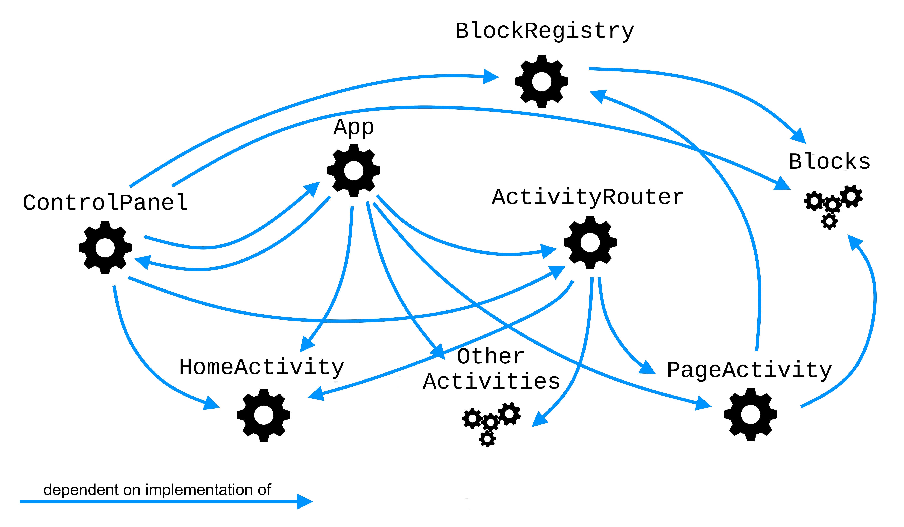

# API Reference

## Table of Contents

1. [Introduction](#introduction)

2. [MiniApp Fundamentals](#miniapp-fundamentals)

3. [Main Concepts](#main-concepts)
	- [Page](#page)
	- [Page Schema](#page-schema)
	- [Block](#block)
	- [Block Registry](#block-registry)
	- [Activity](#activity)
	- [Activity Router](#activity-router)
	- [Control Panel](#control-panel)

4. [Architecture Overview](#architecture-overview)
	- [Server](#server)
	- [Client](#client)
		- [Third-party libraries](#third-party-libraries)
		- [Main MiniApp code](#main-miniapp-code)
		- [Styles](#styles)

5. [Client Architecture](#client-architecture)
	- [Coupling](#coupling)
	- [Interfaces](#interfaces)
		- [Component Classes](#component-classes)
		- [`App` Interface](#app-interface)
		- [`BlockRegistry` Interface](#blockregistry-interface)
		- [`Block` Interface](#block-interface)
		- [`PageActivity` Interface](#pageactivity-interface)
		- [`HomeActivity` Interface](#homeactivity-interface)
		- [`ActivityRouter` Interface](#activityrouter-interface)
		- [`ControlPanel` Interface](#controlpanel-interface)
		- [`EventEmitter` Interface](#eventemitter-interface)

6. [Adding New Block Types](#adding-new-block-types)
	- [Block Lifecycle](#block-lifecycle)
	- [Implementing a Block Type](#implementing-a-block-type)
		- [`static name`](#static-name)
		- [`static typeName`](#static-typename)
		- [`getDefaultProps`](#getdefaultprops)
		- [`buildContent`](#buildcontent)
		- [`buildSettings`](#buildsettings)
		- [`readSettings`](#readsettings)
		- [`applyProps`](#applyprops)
	- [Registering a Block Type](#registering-a-block-type)
	- [Styling](#styling)
	- [Good to Know](#good-to-know)

## Introduction

This page delves into the inner workings of ContentEditBot.

## MiniApp Fundamentals

Telegram MiniApps, also known as WebApps, are the core technology enabling the functionality of this project. The concept behind MiniApps is straightforward but crucial to grasp.

Telegram MiniApps do not operate in isolation; they extend the capabilities of Telegram bots. There are various ways a bot can guide users to access a MiniApp. In short, Telegram bot provides users with special buttons or links that allow them to access the MiniApp (for more information, refer to the [official documentation](https://core.telegram.org/bots/webapps#implementing-mini-apps)).

When a user opens a MiniApp, the Telegram client creates a new window containing a **webview**. Think of a webview as a browser within the Telegram client, devoid of the usual browser UI elements, providing only the web page itself. The development of this web page is the essence of MiniApp development. This web page exhibits some differences from typical web pages, such as offering several methods and properties for interacting with the Telegram client, which are not available on regular web pages. These interactions include:

- Accessing user information
- Retrieving user theme parameters (to seamlessly blend with the Telegram UI)
- Triggering haptic feedback
- Displaying native popups
- And much more

For more comprehensive MiniApp documentation, refer to the [official Telegram documentation](https://core.telegram.org/bots/webapps).

## Main Concepts

Here are listed the key concepts that are frequently referenced throughout the application, providing a foundational understanding.

### Page

The central abstraction upon which the application is constructed, pages serve as the focal point of interaction for both the client and server sides. Pages are also stored within the database and represent what users can create, edit, and share. Each page is associated with essential data, with the most important attributes being:

- `id`: A unique 16-character identifier generated upon page creation.
- `ownerId`: An association linking each page with a Telegram user, granting editing privileges only to the page owner. Pages owned by the user are listed in their home activity.
- `schema`: A data structure describing all the page contents.

### Page Schema

Page schema, often referred to simply as "schema," is typically an object (often JSON-encoded) containing all the necessary information about the page's contents. It encapsulates everything required to display the page. When users edit a page, they are, in fact, modifying the schema. The server treats it as a string, with parsing and composition occurring exclusively on the client side.

The schema object comprises a single property, `children`, which contains a list of **block schemas**. A block schema includes the following properties:

- `typeName`: The block's unique type name (more details in the Block section).
- `props`: Set of data customizing each block instance (further elaborated in the Block section).
- `children`: A list of child block schemas, as blocks can have nested children blocks.

### Block

Blocks, can be referred as components, are the fundamental building units of every page. Server-side code does not directly interact with blocks, as their data is stored within the schema. Each page maintains a collection of blocks, and blocks can also contain other blocks, forming a tree-like structure.

There are no standalone blocks; each block possesses its own type, which defines its appearance, behavior, and a set of properties. Examples of block types include markdown, grid, image, and spoiler. Users create pages by assembling them from a predefined set of registered block types. Each block type may have **props** — a serializable JavaScript object (effectively, a dictionary) that users can configure to customize the block's appearance and behavior. For instance, a markdown block stores the markdown code in its props, while a grid block stores the number of columns in its props.

Each block is assigned a `typeName`, a unique string used for identifying the block type to which it belongs.

### Block Registry

The Block Registry is a client-side singleton object that plays a vital role in expanding the block library with [custom blocks](#adding-new-block-types). It enables other parts of the client code to access block type classes using type names conveniently.

### Activity

The naming of Activities draws inspiration from the commonly used Activities concept within the Android SDK. An Activity is a client-side UI abstraction that represents the route the user is currently viewing. Activities come in various types, each encapsulating the behavior required for different app views. For instance, the `HomeActivity` is responsible for listing users' pages and provides functionality for manipulating them, while the `PageActivity` is responsible for rendering the user's page and, if the user is the page owner, it facilitates page editing.

### Activity Router

Despite the app maintaining a constant URL, it offers users the ability to navigate through different views. The Activity Router serves as a client-side abstraction that handles this functionality. It functions as a stack of activity instances. Other parts of the code can request the router to *push* a new activity, resulting in the opening of a new view for the user. The router can also be instructed to *pop* an activity, such as when the user clicks the WebApp's back button. Thanks to the stack storing previous activities, navigation back occurs instantly. Client-side routing also enables the app to incorporate Telegram-flavored routing animations during navigation.

### Control Panel

The Control Panel is another client-side UI abstraction that operates independently from the activity router. Typically, it resides at the bottom of the viewport and fulfills a range of responsibilities.

The Control Panel can assume one of several modes, each serving a distinct purpose:
- `"page"`: Appears on the `PageActivity` for non-owner users. It displays a button to toggle the page menu.
- `"pageEdit"`: Appears on the `PageActivity` for owner users. It provides buttons to toggle the page menu and the block catalog.
- `"blockDrag"`: Appears on the `PageActivity`. It displays a delete drop area when the user initiates block dragging.
- `"home"`: Appears on the `HomeActivity`. It features a "New Page" button.
- `"homeSelect"`: Appears on the `HomeActivity` when the user selects page items. It presents a "Delete Selected" button.
- `"blockEditor"`: Appears on the `BlockEditorActivity`. It offers buttons for discarding or applying changes.
- `null`: this mode effectively hides the Control Panel.

The `ControlPanel` assumes the role of the WebApp's built-in `MainButton`. However, it offers several enhancements compared to the `MainButton`, including:
- Support for non-button elements like drop areas.
- The ability to accommodate more than one button.
- Integration of Telegram-flavored animations.
- Overall greater customizability.

In addition to the features described above, the `ControlPanel` contains two menus and the capability to display short messages to the user. These menus are:
- `pageMenu`: Presents the available operations for the current page, which currently includes only the "Copy Page Link" button.
- `blockCatalog`: Lists the block types that the page owner can drag to the page.

## Architecture Overview

The application is composed of two main components: a Python server built using the **Bottle framework** and a JavaScript client.

### Server

The server is written in Python and utilizes the [Bottle framework](https://bottlepy.org/docs/dev/) for handling HTTP logic. Bottle is a fast, simple and lightweight WSGI micro web-framework for Python. It implements the WSGI interface, allowing the application to run on remote hosting servers. Server code is organized within Python files located directly under the `src` directory. The server primarily serves four essential functions:

1. Hosting the static front-end, which is stored under the `src/static` directory.
2. Managing Telegram updates and interactions with the Telegram API.
3. Providing a REST API that allows the client to interact with persistent database records. This also includes validating Telegram MiniApp `initData` since the client blindly trusts it.
4. Exposing certain environment variables to the client as a JavaScript module at `/js/config.js`.

The entry file for the server is `src/app.py`, which exports the `application` object for use when connecting with WSGI interfaces. It can also be run in CLI mode, with behavior defined by the following flags:
- `--init`: Creates an SQLite database file if one doesn't already exist, sets up the Telegram menu button, and configures the Telegram webhook for the current web address.
- `--run`: Starts the server, useful for local development.

If nono of the arguments are provided, no action is taken.

Other server files include:
- `src/rest_api.py`: Encapsulates the logic for the REST API, facilitating interactions with pages.
- `src/pages.py`: Houses a library of functions for Create, Read, Update, and Delete (CRUD) operations on pages without direct database interactions.
- `src/tgapi.py`: A library of functions for interacting with the Telegram API.
- `src/util.py`: Provides a collection of reusable functions utilized throughout the code that defy easy categorization.

### Client

The client-side files are housed within the `src/static` directory. The entry point is the `index.html` file, which includes a list of [third-party libraries](#third-party-libraries) as well as the application code itself. It's worth noting that the application does not change the browser's location; all routing is handled on the client, ensuring that the application always remains on the `index.html` page.

#### Third-party Libraries

The application leverages a selection of third-party libraries to provide robust solutions for specific challenges:

- [long-press-event](https://github.com/john-doherty/long-press-event): This library is essential for detecting long touches on mobile devices. Implementing this reliably with DOM-provided methods can be tricky, making this well-maintained, time-tested solution invaluable. As it isn't widely available on common content delivery networks (CDNs), it is hosted within the project.
- `telegram-web-app.js`: This library furnishes an official API for incorporating MiniApp features.
- [SortableJS](https://github.com/SortableJS/Sortable): A highly effective library that manages block drag-and-drop functionality.
- [marked](https://github.com/markedjs/marked): Another excellent library that facilitates the conversion of markdown to HTML.
- [DOMPurify](https://github.com/cure53/DOMPurify): This library serves as a guardian against XSS attacks by sanitizing marked output.
- [lottie](https://airbnb.io/lottie/): It enables the rendering of Lottie graphics to enhance the user experience on pages.
- [rippleJS](https://github.com/samthor/rippleJS): This library enables the addition of a ripple effect to interactive elements, enhancing visual feedback.
- [Highlight.js](https://github.com/highlightjs/highlight.js): The library handling a syntax highlighting for code blocks

#### Main MiniApp Code

The code responsible for displaying a MiniApp resides in the `src/static/js` directory. The entry point is the `app.js` file, which defines the `App` class and initiates the app's initialization process. The project employs ES imports to load other necessary modules.

#### Styles

Style files are located under the `src/static/css` directory. The HTML page loads only the `styles.css` file, which defines global styles and includes other CSS files:
- `reset.css`: This file eradicates browser default styling to ensure a consistent appearance across various browser web views.
- `activities.css`: Responsible for styling activities and their layouts.
- `blocks.css`: Contains styling specifications related to blocks.
- `control-panel.css`: Manages styling for the control panel.
- `telegram.css`: Styles elements to apply the aesthetics, look, and feel of Telegram.

## Client Architecture

### Coupling

Coupling describes the level of interdependence between classes in the codebase. If class A is coupled to class B, it means that class A relies on class B to provide a certain interface, which may take the form of method signatures or a specific set of behaviors that Class B must support.

Understanding coupling is valuable when making changes to the codebase, as it offers developers insights into the potential impact of changes and identifies which parts of the code may be affected.

Below is a diagram illustrating how client classes are coupled to one another:



While it may appear intricate, this diagram can provide valuable insights. For instance, it reveals that the `ActivityRouter` depends on the activities interface but not on the overall app structure. This implies that you can relatively easily extract the `ActivityRouter` and use it in another project.

### Interfaces

Throughout the application, objects interact with one another using implicit interfaces. Some common conventions are consistently applied across the codebase and will not be reiterated for each individual class:
- [Component classes](#component-classes).
- Object constructors do not modify external data.
- Properties containing DOM elements are suffixed with descriptors like `Element`, `Item`, `Button`, and others to distinguish them from data.
- Client code follows camelCase naming conventions for methods and properties.
- Server code adheres to snake_case naming conventions for methods and properties.

Methods and properties not explicitly mentioned below are considered private.

#### Component Classes

If you are familiar with the concept of **components**, you'll find that classes such as `*Activity`, `ActivityRouter`, `App`, `Block`, and `ControlPanel` can be thought of as components. These classes encapsulate logic whose primary purpose is to display a specific part of the page. While the app doesn't explicitly utilize the concept of components, each of these classes adheres to implicit rules and interfaces to maintain code consistency.

None of the component classes become fully functional immediately upon initialization (calling the `constructor`). Instead, each of them requires an initializer to call the `setup` method. The `setup` method performs all necessary initialization tasks, including building DOM elements, adding event listeners, and any other actions required to create a functional DOM element that can be inserted into the page by the initializing code. Each component class exposes this element as a property. The property names differ for various components:
- `activityElement` for each activity class.
- `blockElement` for each block class.
- `activitiesContainer` for `ActivityRouter`.
- `appElement` for `App`.
- `panelElement` for `ControlPanel`.

The `setup` method often includes a call to its own `build` method, which helps to separate the creation of DOM elements from the rest of the initialization logic. Component classes expect their methods to be called and properties accessed only after calling the `setup` method.

#### `App` Interface

Read-only properties:
- `dragActive`: A boolean value indicating whether any block is currently being dragged.
- `home`: A reference to the `HomeActivity` instance if one is present in the router stack; otherwise, `null`.
- `controlPanel`: A reference to the `ControlPanel` instance.
- `router`: A reference to the `ActivityRouter` instance.

Methods:
- `setDragActive(dragActive)`: A setter method for the `dragActive` property.
- `openPage(pageId, appearInstantly=false)`: Loads and opens an existing page given its ID. The `appearInstantly` flag specifies whether the page opening should be animated.
- `createNewPage(onboarding=false, appearInstantly=false)`: Creates a new page in the database and opens it. The `onboarding` flag, when set to true, creates a page from an onboarding template. The `appearInstantly` flag specifies whether the page opening should be animated.
- `goBack()`: Initiates the closing of any opened menu or pops the current activity from the router stack.

#### `BlockRegistry` Interface

Methods:
- `getType(typeName)`: Given a block `typeName`, this method returns the associated class.
- `getAllTypes()`: Returns an array of registered block types. Each block type is represented as an array containing two items: `typeName` and the corresponding class.

#### `Block` Interface

Read-only properties:
- `props`: The current block props.
- `settingsElement`: A reference to the DOM element containing the user interface (UI) for editing block props.

Methods:
- `applySettings()`: Performs all the necessary logic to handle the user clicking the "Apply" button in the block editor. This includes updating the `props` property, modifying the block's DOM structure and behavior, and applying visual effects.
- `readSettings()`: Reads values from the settings UI, composes them into the `props` object, and returns the resulting object.
- `applyProps(props)`: Executes all props-dependent setup tasks based on the `props` argument. This method must function correctly when called multiple times during the instance's lifetime.

#### `PageActivity` Interface

Read-only properties:
- `initData`: An object storing raw data retrieved from the database row. This should not be confused with Telegram MiniApp's `initData`.
- `schema`: The schema of the current page.
- `id`: The ID of the page.
- `editable`: A boolean value indicating whether the page is in edit mode.

Methods:
- `save()`: Saves the current page schema to the database.
- `applySchema(schema)`: Constructs the page's DOM structure according to the `schema` argument.
- `readSchema()`: Traverses the page's DOM to compose the page schema and returns it.
- `getTitle()`: Retrieves the page title from the page's DOM and returns it.
- `getLink()`: Generates a shareable link to the current page.

#### `HomeActivity` Interface

Read-only properties:
- `selectMode`: A boolean value indicating whether the page is in select mode (when the user selected one or more page items).
- `selectedPages`: An array of IDs for pages that are currently selected. This array is empty when `selectMode` is `false`.

Methods:
- `deleteSelectedPages()`: Prompts the user to confirm the deletion of selected pages and proceeds with the deletion from the database upon confirmation.
- `addNewPage()`: Adds a page item to the list of user pages using the provided page data.

#### `BlockEditorActivity` Interface

Read-only properties:
- `targetBlock`: A reference the instance of the block that is edited by this activity.

Methods:
- `apply()`: Causes the editing block to apply the settings entered by the user.

#### `ActivityRouter` Interface

Read-only properties:
- `curActivity`: A reference to the current activity instance (last one in the stack).
- `stack`: The current stack of activity instances in the form of an array.

Methods:
- `pushActivity(activity)`: Appends a new activity instance to the stack of activities, making it active and visible to the user. In simple terms, this adds a page to the navigation history.
- `popActivity()`: Deactivates and disposes of the current activity and activates the previous one. In simple terms, this navigates back in the navigation history.

#### `ControlPanel` Interface

Read-only properties:
- `app`: A reference to the current `App` instance.
- `activeMode`: The name of the currently active control panel mode, or `null` if no mode is active.
- `activeMenu`: The name of the currently active control panel menu, or `null` if no menu is active.

Methods:
- `setMode(modeName)`: Switches the control panel to the specified mode given its [name](#control-panel).
- `toggleMenu(menuName)`: Displays the menu by its name or closes it if it's already shown.
- `showMessage(message, error=false, time=3000)`: Displays a message at the bottom of the page for a specified duration in milliseconds, as specified in the `time` argument. If the `error` argument is set to `true`, the message will be displayed in red.

#### `EventEmitter` Interface

This class provides a simple event subscription mechanism and is not meant to be instantiated directly. Instead, it's intended to be extended by various classes, allowing them to trigger events and enabling other objects to add callbacks to these events. This approach helps reduce code coupling. The following methods accomplish this functionality:
- `addCallback(eventName, callback)`: Registers a callback for the specified `eventName`. Multiple callbacks can be registered for a single event.
- `removeCallback(eventName, callback)`: Removes a callback from the specified event given the `eventName` and `callback`.
- `triggerEvent(eventName, params=[])`: This method is intended for internal usage within objects. Calling this method triggers all the callbacks associated with the given `eventName`. It accepts an optional `params` array argument that will be destructured and passed to the callbacks.

## Adding New Block Types

To extend the app with a new block type, you need to follow two key steps:

1. [Implement the New Block Type](#implementing-a-block-type)
2. [Register Your Block Type](#registering-a-block-type)

Before adding a new block type, it's essential to understand the block's lifecycle.

### Block Lifecycle

The server does not interact with the blocks in any way; therefore, all block logic is entirely client-side. The block lifecycle can be outlined as follows:

1. Creating a new block triggers the initialization of a block type class.
2. The block instance initializes itself with a default set of props, which is specific to each block type.
3. The block instance constructs a DOM element and assigns custom behavior.
4. Optionally, the user can edit the block's props on the client, triggering an update of the DOM element by the block instance.
5. Optionally, the user can change the order of the blocks in the DOM.
6. When the page is saved, the `PageActivity` instance traverses the DOM and composes the page schema, which stores each block's props, `typeName`, and position.
7. The client encodes the page schema as JSON and sends it to the server.
8. The server treats the incoming schema as a string without attempting to analyze, validate, alter, or interact with it, and it saves the schema to the database.
9. When the user opens the page, the client fetches the schema from the server and decodes it.
10. For each block schema, the `PageActivity` instance identifies the block type class by its `typeName` and constructs the block instance, providing the props stored in the schema.
11. The block instance constructs a DOM element and defines behavior based on the provided props.
12. The `PageActivity` instance inserts all block elements into the DOM following the order and hierarchy specified in the schema.

#### ⚠️ Warning
It's crucial to note that the server cannot validate the schema, and technically, the user can submit anything as a schema. Therefore, client code, including block classes, must be cautious when applying the schema, as it may contain malicious code and pose a security risk. For example, the Markdown block uses the DOMPurify library to sanitize HTML before inserting it into the page.

### Implementing a Block Type

The base block class is `Block`, located in the `src/static/js/block.js` module. This class is abstract and serves as a template for each block type to extend. It provides common logic shared by all block types and defines a set of methods for subclasses to implement.

Each block type class should be located in a `src/static/js/block-types` directory and export its class as a default export. Every property and method that each block type should implement are listed below.

#### `static name`

- **Type**: `string`

This static property is necessary for other parts of the app to determine how to name the block for the user. Currently, it is primarily used by the block catalog.

#### `static typeName`

- **Type**: `string`

This static property defines a unique value that serves as an identifier for the class in various contexts, such as creating a schema or applying a schema.

#### `getDefaultProps`

- **Asynchronous**: No
- **Arguments**: None
- **Returns**: An `Object` containing the props that will be applied to the block upon initial creation.

The props returned by this method will be applied to the block when it is constructed without props. If the block is not configurable (i.e., it has no props), the method should return an empty object `{}`.

#### `buildContent`

- **Asynchronous**: No
- **Arguments**: None
- **Returns**: None

By the time this method is called, the block instance already has the `blockElement` propertiy assigned. The `blockElement` represents the DOM element that will be inserted into the page and be visible to the user, so any setup related to the block's structure and behavior should be performed in this method. The method should not handle props-dependent setup, as this is the responsibility of the `applyProps` [method](#applyprops).

For example, if the block type represents an interactive chart, this method would insert all the necessary DOM elements into `blockElement` to display the chart and add event listeners to enable user interaction. This method is called only once during the block instance's lifetime.

If the block type is designed to contain children blocks, the `buildContent` method should assign the `childrenContainer` property, which is an empty DOM element with the `blockContainer` CSS class. Once the `childrenContainer` property is assigned, the `PageActivity` instance takes over the responsibility for handling child blocks, ensuring that all necessary setup occurs independently of the current block instance.

#### `buildSettings`

- **Asynchronous**: No
- **Arguments**: None
- **Returns**: None

When this method is called, the block instance already has the `settingsElement` property. `settingsElement` is the DOM element that will be inserted into the block editor activity when the user starts editing the block. It should provide all the controls necessary to create a user-accessible interface for editing block props. For example, if the block type represents an interactive chart, this method may insert all the required DOM elements into `settingsElement` to display input fields for entering axis names and other customizations. This method is called only once during the block instance's lifetime.

Additionally, this method should populate all input values according to the current props. In other words, calling `buildSettings` and then immediately calling `readSettings` should return the props identical to the `props` property of the block instance.

#### `readSettings`

- **Asynchronous**: Yes
- **Arguments**: None
- **Returns**: `props` (`Object`) if successful or `Boolean` `false` if validation fails.

This method is called when the user clicks the "Apply" button on the block editor activity. It should read and validate all values entered by the user within the `settingsElement`.

If the values are invalid (e.g., a negative number or an invalid input for table columns), the method should return `false` to inform the calling method that the settings cannot be applied. Otherwise, the method should compile all the entered values from the `settingsElement` inputs into the `props` object and return it.

#### `applyProps`

- **Asynchronous**: Yes
- **Arguments**: `props` (`Object`)
- **Returns**: `Promise<None>`

This method is called when it's necessary to update the `props`. The method should assign the `props` argument to its own `props` property and update its own `blockElement` DOM to reflect the new props. It is guaranteed to be called after `buildContent` and should correctly function when run multiple times during the instance's lifetime.

### Registering a Block Type

Block type classes are stored within the `src/static/js/block-types` directory and are imported by the **Block Registry**. The Block Registry is a client-side singleton class that acts as a bridge between block types and the rest of the code. It serves two primary purposes:

1. Developers can add their own block types with minimal effort by simply adding two lines of code to the block registry without needing to modify the rest of the code.
2. The rest of the app can access block type classes using just their type name and interact with them using the [implicit block interface](#block-interface).

After you've created a block type class and saved it within the `block-types` directory, the final step to integrate the block into the app is to add the following lines of code to the bottom of the `block-registry.js` file:
```javascript
import MyNewBlock from "./block-types/my-new-block.js";
blockRegistry.registerType(MyNewBlock);
```

Please replace `MyCustomBlock` with the actual class name of your block type, and change the file name `my-custom-block.js` to match the name of your module. If you've completed these steps correctly, your bot should display the block type to users in the block catalog, allowing them to add it to their pages.

### Styling

Currently, the app doesn't incorporate any CSS modules or any specific styles separation for block types. It is recommended to add styles for all new blocks to the `src/public/css/blocks.css` file. This stylesheet file contains all the styling specific to the blocks.

### Good to know

- The app triggers autosave after every block order change or props editing.
- During page editing, users won't be able to click on a block as it opens the block editor.
- Feel free to refer to the built-in block library as a reference for implementing your own blocks.
- The app can be accessed from the [developer console](https://core.telegram.org/bots/webapps#debug-mode-for-mini-apps) using `window.app`.
